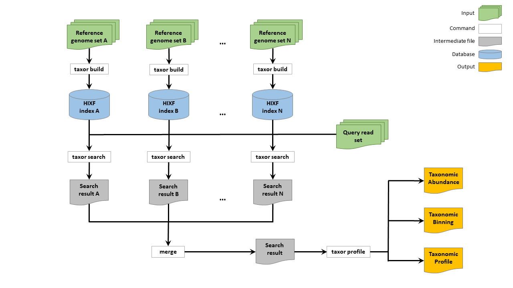

<center></center>

# Taxor: Fast and space-efficient taxonomic classification of long reads with hierarchical interleaved XOR filters

## Citation

## Table of contents

* [Description](#description)
* [Installation](#installation)
* [Commands](#commands)
* [Usage](#usage)

## <a name="installation"></a>Installation

The easiest way is to simply download [executable binaries](https://github.com/shenwei356/kmcp/releases) for Linux x86_64. 

## <a name="commands"></a>Commands

|Subcommand                                                                |Function                                                        |
|:-------------------------------------------------------------------------|:---------------------------------------------------------------|
|[**build**](#build)                                                       | Construct HIXF index from fasta reference files                |
|[**search**](#search)                                                     | Search sequences against a database index                      |
|[**profile**](#profile)                                                   | Generate the taxonomic profile from search results             |


## <a name="usage"></a>Usage



First download the reference sequences and taxonomy dump of the sequences from the NCBI using [genome_updater](https://github.com/pirovc/genome_updater). 
```
genome_updater.sh \
    -d "refseq"\
    -g "archaea,bacteria,fungi,viral" \
    -c "all" \
    -l "complete genome,chromosome" \
    -f "genomic.fna.gz" \
    -o "refseq-abv" \
    -t 12 \
    -A "species:1" \
    -m -a -p
```
Then, unpack the taxonomy dump and create a tab-separated-values file using the Linux command [cut](https://man7.org/linux/man-pages/man1/cut.1.html) and [taxonkit](https://github.com/shenwei356/taxonkit).

```
# cd to 2023-03-15_12-56-12

# taxdump
mkdir -p taxdump
tar -zxvf taxdump.tar.gz -C taxdump

cut -f 1,7,20 assembly_summary.txt \
| taxonkit lineage -i 2 -r -n -L --data-dir taxdump \
| taxonkit reformat -I 2 -P -t --data-dir taxdump \
| cut -f 1,2,3,4,6,7 > refseq_accessions_taxonomy.csv

```
Now we can build the hierarchical interleaved XOR filter (HIXF) index of the reference sequences and the NCBI taxonomy.
```
taxor build --input-file refseq_accessions_taxonomy.csv --input-sequence_dir refseq/2023-03-15_12-56-12/files \
--output-filename refseq-abfv-k22-s12.hixf --threads 6 --kmer-size 22 --syncmer-size 12 --use-syncmer
```
Then, we query the sample fastq file against the index allowing in this case a sequencing error rate of 15%. 
```
taxor search --index-file refseq-abfv-k22-s12.hixf --query-file SAMPLE.fq.gz \
--output-file SAMPLE.search.txt --error-rate 0.15 --threads 6 
```
Finally, the query result file is used as input for taxonomic profiling, which has three output files containing taxonomic abundances and sequence abundances in CAMI report format as well as a binning file with final read to reference assignments.
```
taxor profile --search-file SAMPLE.search.txt --cami-report-file SAMPLE.report \
--seq-abundance-file SAMPLE.abundance --binning-file SAMPLE.binning --sample-id SAMPLE
```
