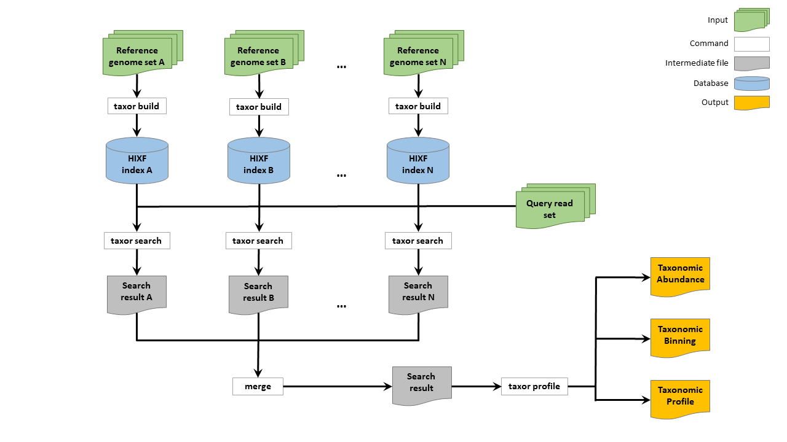

<center></center>

# Taxor: Fast and space-efficient taxonomic classification of long reads with hierarchical interleaved XOR filters

## Citation

## Table of contents

* [Description](#description)
* [Installation](#installation)
* [Commands](#commands)
* [Usage](#usage)

## <a name="description"></a>Description

Taxor is a taxonomic classification and profiling tool that efficiently classifies DNA sequences against large sets of genomic reference sequences. Taxor stores k-mers in an optimized hierarchical interleaved XOR filter (HIXF) index and combines k-mer similarity and genome coverage information for precise taxonomic classification and profiling. It features:

* Low false positive rates for k-mer matching 
* NCBI taxonomy integration
* Open canonical syncmers as k-mer selection scheme for improved downsampling
* classification with binning and taxonomic profiling
* read reassignment EM algorithm for multi-matching reads
* advanced filtration of search results
* taxonomic and sequence abundance reports with genome size correction

Benchmarking results based on simulated and real long-read data sets demonstrate that Taxor enables more precise taxonomic classification and profiling of microbial populations while having a smaller memory footprint than other tools.

## <a name="installation"></a>Installation

The easiest way is to simply download [executable binaries](https://github.com/shenwei356/kmcp/releases) for Linux x86_64. <br>
However, you can also build Taxor on your own using the following commands. Just make sure that you have installed [CMake](https://cmake.org/) (>=3.16) and [GCC](https://gcc.gnu.org/) (>= 10).

```
git clone https://github.com/JensUweUlrich/Taxor.git
cd Taxor
mkdir build
cd build
cmake  ../src
cmake --build . --config Release
```

## <a name="commands"></a>Commands

|Subcommand                                                                |Function                                                        |
|:-------------------------------------------------------------------------|:---------------------------------------------------------------|
|[**build**](#build)                                                       | Construct HIXF index from fasta reference files                |
|[**search**](#search)                                                     | Search sequences against a database index                      |
|[**profile**](#profile)                                                   | Generate the taxonomic profile from search results             |


### <a name="build"></a>Taxor build

```
taxor-build - Creates and HIXF index of a given set of fasta files
==================================================================

DESCRIPTION
    Creates an HIXF index using either k-mers or syncmers

OPTIONS

  Basic options:
    -h, --help
          Prints the help page.
    -hh, --advanced-help
          Prints the help page including advanced options.
    --version
          Prints the version information.
    --copyright
          Prints the copyright/license information.
    --export-help (std::string)
          Export the help page information. Value must be one of [html, man].

  Main options:
    --input-file (std::string)
          tab-separated-value file containing taxonomy information and reference file names
    --input-sequence-dir (std::string)
          directory containing the fasta reference files Default: .
    --output-filename (std::string)
          A file name for the resulting index. Default: .
    --kmer-size (signed 32 bit integer)
          size of kmers used for index construction Default: 20. Value must be in range [1,30].
    --syncmer-size (signed 32 bit integer)
          size of syncmer used for index construction Default: 10. Value must be in range [1,26].
    --threads (signed 32 bit integer)
          The number of threads to use. Default: 1. Value must be in range [1,32].
    --use-syncmer
          enable using syncmers for smaller index size
```

<b> input-file</b><br>
This file contains all relevant information about the organisms in the database, which will be indexed. All values are tab-separated and the file should have following columns:
* Column 1: Assembly accession: the assembly accession.version reported in this field is 
   a unique identifier for the set of sequences in this particular version of 
   the genome assembly.
* Column 2: Taxonomy ID: the NCBI taxonomy identifier for the organism from which the 
   genome assembly was derived. The NCBI Taxonomy Database is a curated 
   classification and nomenclature for all of the organisms in the public 
   sequence databases. The taxonomy record can be retrieved from the NCBI 
   Taxonomy resource:
   https://www.ncbi.nlm.nih.gov/taxonomy/
 * Column 3: FTP path: the path to the directory on the NCBI genomes FTP site from which 
   data for this genome assembly can be downloaded
 * Column 4: Organism name
 * Column 5: Taxonomy string
 * Column 6: Taxonomy ID string

A two-line example of such a file is provided below. You can easily create such a file by following the preprocessing steps described in the [Usage](#usage) section.

```
GCF_000002495.2	318829	https://ftp.ncbi.nlm.nih.gov/genomes/all/GCF/000/002/495/GCF_000002495.2_MG8	Pyricularia oryzae	k__Eukaryota;p__Ascomycota;c__Sordariomycetes;o__Magnaporthales;f__Pyriculariaceae;g__Pyricularia;s__Pyricularia oryzae	2759;4890;147550;639021;2528436;48558;318829
GCF_000002515.2	28985	https://ftp.ncbi.nlm.nih.gov/genomes/all/GCF/000/002/515/GCF_000002515.2_ASM251v1	Kluyveromyces lactis	k__Eukaryota;p__Ascomycota;c__Saccharomycetes;o__Saccharomycetales;f__Saccharomycetaceae;g__Kluyveromyces;s__Kluyveromyces lactis	2759;4890;4891;4892;4893;4910;28985
```

<b> input-sequence-dir</b><br>
Path to the directory containing fasta files (compressed) of organisms listed in the tab-separated file explained above. The file stem of the fasta files needs to match the last directory path string of the FTP path in column 3 of the input file (e.g. GCF_000002495.2_MG8)

<b> output-filename</b><br>
Path to the output file containing the hierarchical interleaved XOR filter index of the reference sequences and taxonomy information for the profiling step.

<b> kmer-size</b><br>
Size of k-length-substrings used for pseudo-mapping. When using syncmers for downsampling, the kmer-size has to be even-numbered because of using open canonical syncmers. The maximum supported k-mer size is 30.

<b> syncmer-size</b><br>
Size of the substrings used for selecting a k-mer for pseudo-mapping. The syncmer-size also has to be even-numbered because of the usage of open canonical syncmers. This number needs to be smaller than the k-mer size and the maximum supported size is 26.

<b> use-syncmer</b><br>
Switch that enables the usage of syncmers for downsampling of k-mers.

<b> threads</b><br>
Number of threads used for computing the hierarchical structure and building the HIXF index.

### <a name="search"></a>Taxor search

```
taxor-search - Queries a file of DNA sequences against an HIXF index
====================================================================

DESCRIPTION
    Query sequences against the taxor HIXF index structure

OPTIONS

  Basic options:
    -h, --help
          Prints the help page.
    -hh, --advanced-help
          Prints the help page including advanced options.
    --version
          Prints the version information.
    --copyright
          Prints the copyright/license information.
    --export-help (std::string)
          Export the help page information. Value must be one of [html, man].

  Main options:
    --index-file (std::string)
          taxor index file containing HIXF index and reference sequence information
    --query-file (std::string)
          file containing sequences to query against the index Default: .
    --output-file (std::string)
          A file name for the resulting output. Default: .
    --threads (unsigned 8 bit integer)
          The number of threads to use. Default: 1. Value must be in range [1,32].
    --percentage (double)
          If set, this threshold is used instead of the k-mer/syncmer models. Default: -1. Value must be in range
          [0,1].
    --error-rate (double)
          Expected error rate of reads that will be queried Default: 0.04. Value must be in range [0,1].

```

<b> index-file</b><br>
Path to the file containing the hierarchical interleaved XOR filter index of the reference sequences and taxonomy information for the profiling step.

<b> query-file</b><br>
Path to a fast(a/q) file containing sequenced reads of a sample, which shall be taxonomically classified. This file can be gzip compressed.

<b> output-file</b><br>
Path to the output file containing results of the classification step. This file is tab-separated with 10 columns per line.
* Column 1  : read identifier
* Column 2  : Assembly Accession ID of the matching reference
* Column 3  : Organism name of the matching reference
* Column 4  : Taxonomy ID of the matching reference
* Column 5  : Cumulative length of the matching reference sequence
* Column 6  : Sequence length of the queried read
* Column 7  : Overall number of k-mers (syncmers) generated from the queried read
* Column 8  : Number of k-mers (syncmers) of the query read that match with the reference sequence
* Column 9  : Taxonomy string of the matched reference
* Column 10 : Taxonomy ID string of the matched reference

```
#QUERY_NAME	ACCESSION	REFERENCE_NAME	TAXID	REF_LEN	QUERY_LEN	QHASH_COUNT	QHASH_MATCH TAX_STR TAX_ID_STR
f3a88e6f-9873-445a-b0c7-2406f3a360fc|1613       GCF_022819245.1 Limosilactobacillus fermentum   1613    2016236 1139    98      56      k__Bacteria;p__Bacillota;c__Bacilli;o__Lactobacillales;f__Lactobacillaceae;g__Limosilactobacillus;s__Limosilactobacillus fermentum      2;1239;91061;186826;33958;2742598;1613
9d3a345f-3bf7-4304-977c-ee8b2b3c2b17|96241      GCF_000959025.1 Bacillus intestinalis   1963032 4031727 2589    224     104     k__Bacteria;p__Bacillota;c__Bacilli;o__Bacillales;f__Bacillaceae;g__Bacillus;s__Bacillus intestinalis   2;1239;91061;1385;186817;1386;1963032
9d3a345f-3bf7-4304-977c-ee8b2b3c2b17|96241      GCF_006094475.1 Bacillus spizizenii     96241   4045538 2589    224     104     k__Bacteria;p__Bacillota;c__Bacilli;o__Bacillales;f__Bacillaceae;g__Bacillus;s__Bacillus spizizenii     2;1239;91061;1385;186817;1386;96241
4e845c81-7397-4956-bdb2-5893b450aa3e|1613       GCF_022819245.1 Limosilactobacillus fermentum   1613    2016236 1790    158     38      k__Bacteria;p__Bacillota;c__Bacilli;o__Lactobacillales;f__Lactobacillaceae;g__Limosilactobacillus;s__Limosilactobacillus fermentum      2;1239;91061;186826;33958;2742598;1613
acc4abca-4daf-4af1-a3fc-edc189c37095|2807625    GCF_018622975.1 Staphylococcus sp. MZ9  2836367 2860948 3971    344     158     k__Bacteria;p__Bacillota;c__Bacilli;o__Bacillales;f__Staphylococcaceae;g__Staphylococcus;s__Staphylococcus sp. MZ9      2;1239;91061;1385;90964;1279;2836367
```
<b> threads</b><br>
Number of threads used for querying the sequences in the input file against the HIXF index.

<b> percentage</b><br>
Can be used to define the minimum percentage of k-mers/syncmers that need to match a reference. By default we use the k-mer model from [Blanca et al.](https://www.liebertpub.com/doi/abs/10.1089/cmb.2021.0431?journalCode=cmb) or empircally computed values for determining the thesholds for reporting a match. 

<b> error-rate</b><br>
For more accurate classification of reads we are calculating the expected number of mutated k-mers for each read prefix based on the expected sequencing error rate. Than a confidence interval for the mutated k-mers is calculated as described by [Blanca et al.](https://www.liebertpub.com/doi/abs/10.1089/cmb.2021.0431?journalCode=cmb) and the minimum number of matching k-mers is calculated based on the upper bound of the confidence interval. The significance level of the confidence interval is set to 95% by default. When using synmcers, we are using emprically calculated minimum numbers of matching syncmers for a given error rate and k-mer length.

### <a name="profile"></a>Taxor profile

```
taxor-profile - Taxonomic profiling of a sample by giving read matching results of Taxor search
===============================================================================================

DESCRIPTION
    Taxonomic profiling of the given read set

OPTIONS

  Basic options:
    -h, --help
          Prints the help page.
    -hh, --advanced-help
          Prints the help page including advanced options.
    --version
          Prints the version information.
    --copyright
          Prints the copyright/license information.
    --export-help (std::string)
          Export the help page information. Value must be one of [html, man].

  Main options:
    --search-file (std::string)
          taxor search file containing results of read querying against the HIXF index
    --cami-report-file (std::string)
          output file reporting genomic abundances in CAMI profiling format. This is the relative genome abundance in
          terms of the genome copy number for the respective TAXID in the overall sample. Note that this is not
          identical to the relative abundance in terms of assigned base pairs.
    --seq-abundance-file (std::string)
          output file reporting sequence abundance in CAMI profiling format (including unclassified reads). This is
          the relative sequence abundance in terms of sequenced base pairs for the respective TAXID in the overall
          sample. Note that this is not identical to the genomic abundance in terms of genome copy number for the
          respective TAXID. Default: .
    --binning-file (std::string)
          output file reporting read to taxa assignments in CAMI binning format
    --sample-id (std::string)
          Identifier of the analyzed sample
    --threads (unsigned 8 bit integer)
          The number of threads to use. Default: 1. Value must be in range [1,32].
```

<b> search-file</b><br>
Path to the output file of the [search](#search) step containing results of the classification. This file is tab-separated with 10 columns per line as described above.

<b> cami-report-file</b><br>
Output file reporting genomic abundances in CAMI profiling format. This is the relative genome abundance or taxonomic abundance in terms of the genome copy number for the respective TAXID in the overall sample. 

<b> seq-abundance-file</b><br>
Output file reporting sequence abundance in CAMI profiling format (including unclassified reads). This is the relative sequence abundance in terms of sequenced base pairs for the respective TAXID in the overall sample.

<b> binning-file</b><br>
Output file reporting read to taxon assignments in CAMI binning format.

<b> sample-id</b><br>
String that identifies the analyzed sample.

<b> threads</b><br>
Number of threads used for taxonomic profiling.

## <a name="usage"></a>Usage



First download the reference sequences and taxonomy dump of the sequences from the NCBI using [genome_updater](https://github.com/pirovc/genome_updater). 
```
genome_updater.sh \
    -d "refseq"\
    -g "archaea,bacteria,fungi,viral" \
    -c "all" \
    -l "complete genome,chromosome" \
    -f "genomic.fna.gz" \
    -o "refseq-abv" \
    -t 12 \
    -A "species:1" \
    -m -a -p
```
Then, unpack the taxonomy dump and create a tab-separated-values file using the Linux command [cut](https://man7.org/linux/man-pages/man1/cut.1.html) and [taxonkit](https://github.com/shenwei356/taxonkit).

```
# cd to 2023-03-15_12-56-12

# taxdump
mkdir -p taxdump
tar -zxvf taxdump.tar.gz -C taxdump

cut -f 1,7,20 assembly_summary.txt \
| taxonkit lineage -i 2 -r -n -L --data-dir taxdump \
| taxonkit reformat -I 2 -P -t --data-dir taxdump \
| cut -f 1,2,3,4,6,7 > refseq_accessions_taxonomy.csv

```
Now we can build the hierarchical interleaved XOR filter (HIXF) index of the reference sequences and the NCBI taxonomy.
```
taxor build --input-file refseq_accessions_taxonomy.csv --input-sequence-dir refseq/2023-03-15_12-56-12/files \
--output-filename refseq-abfv-k22-s12.hixf --threads 6 --kmer-size 22 --syncmer-size 12 --use-syncmer
```
Then, we query the sample fastq file against the index allowing in this case a sequencing error rate of 15%. 
```
taxor search --index-file refseq-abfv-k22-s12.hixf --query-file SAMPLE.fq.gz \
--output-file SAMPLE.search.txt --error-rate 0.15 --threads 6 
```
Finally, the query result file is used as input for taxonomic profiling, which has three output files containing taxonomic abundances and sequence abundances in CAMI report format as well as a binning file with final read to reference assignments.
```
taxor profile --search-file SAMPLE.search.txt --cami-report-file SAMPLE.report \
--seq-abundance-file SAMPLE.abundance --binning-file SAMPLE.binning --sample-id SAMPLE
```
